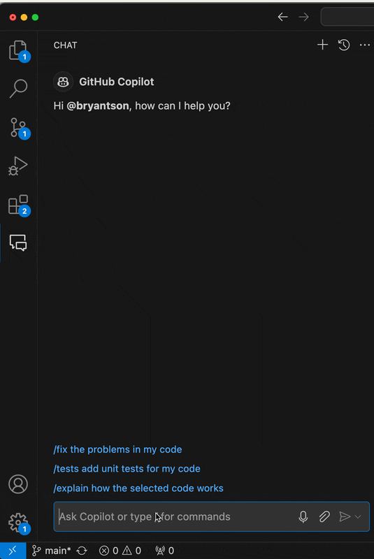
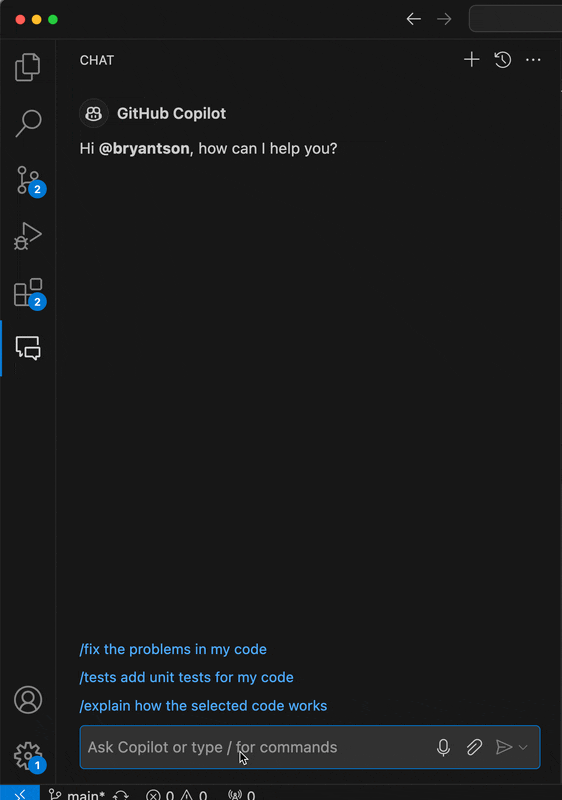

# Exercise 1-1: Starting with unit testing with Javascript through GitHub Copilot

This exercise should be the first one demonstrating how to leverage GitHub Copilot to speed up the development process of a Javascript testing frameworks like Jest, and also discover new ways to write tests.

In this directory `Exercise1-1`, you will find the following files:
- `sum.js`: A simple Javascript file that contains a function that adds two numbers.

Open the `sum.js` file through **Visual Studio Code** and follow the instructions to complete the exercise.

### Step 1: Ask GitHub Copilot Chat to ask how to write unit tests

We have a file `sum.js` that contains a simple function that adds two numbers. Let's say we want to start by asking GitHub Copilot to help us write a unit test for this function.

Open up **GitHub Copilot Chat** panel and ask a question like this:

`How to start creating unit tests for my sum.js?`

Of course, this is not the only way to ask GitHub Copilot to write a unit test, but this is really a quick way to start for sure. Now, GitHub Copilot is super generative, and your response can vary depending on the context of your project, when you ask, and how you ask. And there are different unit testing frameworks like Jest, Mocha, Jasmine, etc. that you can use to write unit tests. In the sample animating screenshot above, GitHub Copilot is suggesting one with Jest. That is maybe or maybe not what you want. You can always ask GitHub Copilot to write a unit test with a different testing framework. For example, you can ask like this:

`How to start creating unit tests for my sum.js with Mocha?`

